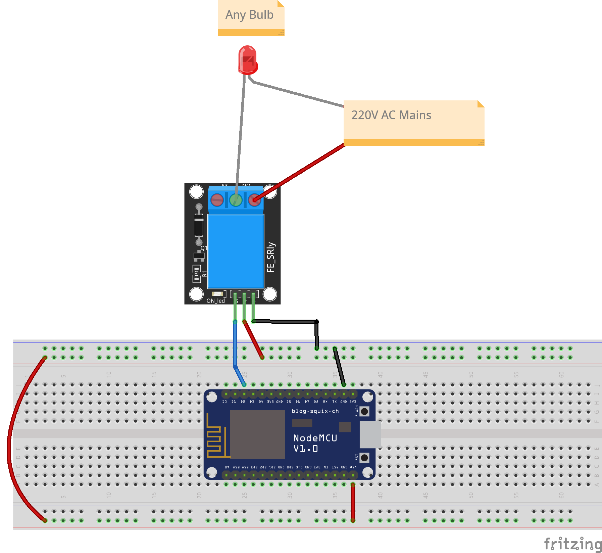
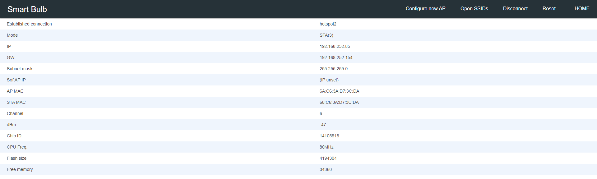

<p align="center">
  <a href="" rel="noopener">
 </a>
</p>

<h3 align="center">Smart Bulb</h3>

<div align="center">

[]()

</div>

---

<p align="center"> Smart Bulb
    <br> 
</p>

## 📝 Table of Contents

- [About](#about)
- [Getting Started](#getting_started)
- [Circuit](#circuit)
- [Usage](#usage)
- [List Of Components](#list)
- [Demo Video](#demovideo)
- [Built Using](#built_using)
- [Authors](#authors)

## 🧐 About <a name = "about"></a>

This repo contains

- WebApp
- Firmware
- Detailed instructions

for Smart Bulb.

## Getting Started <a name = "getting_started"></a>

These instructions will get you a copy of the project up and running on your system.

### Prerequisites

Things you need to install the FW.

```
- Arduino IDE
```

### Installing <a name = "installing"></a>

A step by step series that tell you how to get the Firmware and Backend running

#### ESP32 Configuration

You should have Arduino IDE Installed

1.  Add ESP8266 Board to your Arduino IDE
1.  In your Arduino IDE, go to File> Preferences
    Installing ESP32 Add-on in Arduino IDE Windows, Mac OS X, Linux open preferences
1.  Enter `https://dl.espressif.com/dl/package_esp32_index.json`
    into the “Additional Board Manager URLs” field then, click the “OK” button:
    Note: if you already have the ESP32/ESP8266 boards URL, you can separate the URLs with a comma(each board will go to neaw line) as follows:
    `https://dl.espressif.com/dl/package_esp32_index.json,\n http://arduino.esp8266.com/stable/package_esp8266com_index.json`

1.  Open the Boards Manager. Go to Tools > Board > Boards Manager…
1.  Search for ESP8266 and press install button for the ESP8266 by Espressif Systems“:
1.  That’s it. It should be installed after a few seconds.
1.  In your Arduino sketchbook directory, create tools directory if it doesn't exist yet.
1.  Unpack the tool into tools directory(present in libs/ESP8266FS-0.5.0.zip) (the path will look like <home_dir>/Arduino/tools/ESP8266FS/tool/esp8266fs.jar).
1.  Close and re-open the Arduino IDE.

1.  Now copy the contents of the libs folder to the libraries directory of your Arduino
    1. If you are using windows, the libraries directory will be Documents/Arduino/libraries

##### ESP8266 WiFi Node FW Uploading

1.  Select NodeMCU 1.0 (ESP-12E Module)e from Tools->Board->ESP8266 Boards
2.  Select the correct port from Tools->Port
3.  Then open Firmware.ino file from Firmware/WiFiDevice folder,
4.  Select Tools > ESP8266 Sketch Data Upload menu item. This should start uploading the files into ESP8266 flash file system.
5.  Now Upload the Code to your ESP8266.
6.  Your ESP8266 is now ready to be used.

## Circuit <a name = "circuit"></a>

### ESP32 Dev Module Pinout

Follow the pinout diagram given below to connect different components to your ESP32 Dev Module board.


### Complete Circuit Diagram

Here's the complete circuit diagram of the system.



### Other Components

```http
Other components pin connection details
```

#### ESP32 Connections

```TWO ESP32 Device Connections```

| ESP32 BLE | ESP32 WiFi| 
| :--- | :--- | 
| `TX2` | `RX2` |
| `RX2` | `TX2` |
| `GND` | `GND` | 
 

Note: If the scanning process does not start, press EN button on both ESP32 devices.

## Usage <a name = "usage"></a>

1.  Upload the code to your ESP32.
2.  Power on your ESP32, it will present you with an AP named `SBS-abc` (while `SBS` can be changed in the portal and `abc` is a unique id for each esp32) 
3.  Default captive portal password `123456789AP` which can be changed in captive portal. 
4.  Connect to the ESP32 access point and open the web-browser and navigate to the link `http://bulb.local/_ac`. This link will work on most of the operating systems but if your operating system is not allowing to open it, you may want to check the captive portal IP Address from the serial monitor and can use that IP address inplace of the above mentioned URL. 
5.  The default access IP Address is `http://192.168.4.1/_ac` 
6.  You will be presented with a main dashboard as shown below(based on your device)

7. Go to Connect to WiFi tab and put your WiFi credentials to connect the ESP32 to the server.
8.  Once connected to a WiFi network, you can again access the captive portal using same URL or the IP Address from the Serial monitor.
9. You can open settings page with following default credentials
   1.  User: **SBS**
   2.  Password: **admin**
10.   Dashbaord Link: https://nodered-proxy.production.wrapdrive.tech/ui/#!/2


## List of Components <a name = "list"></a>

Following components are used to make this project

1.  2x ESP32 Dev Module
    ○ https://www.amazon.com/ESP32-WROOM-32-Development-ESP-32S-Bluetooth-Arduino/dp/B084KWNMM4/ref=sr_1_3?dchild=1&keywords=esp32+devkit&qid=1635342032&sr=8-3


## 📽️ Demo Video <a name = "demovideo"></a>

- [BLEScanner Demo](https://youtu.be/45gjfFNWENM) - BLE Scanner Demo Video


## ⛏️ Built Using <a name = "built_using"></a>


- [Arduino](https://www.arduino.cc/) - Embedded Framework and IDE - For Sensor Node Design


## ✍️ Authors <a name = "authors"></a>

- [@Nauman3S](https://github.com/Nauman3S) - Development and Deployment
